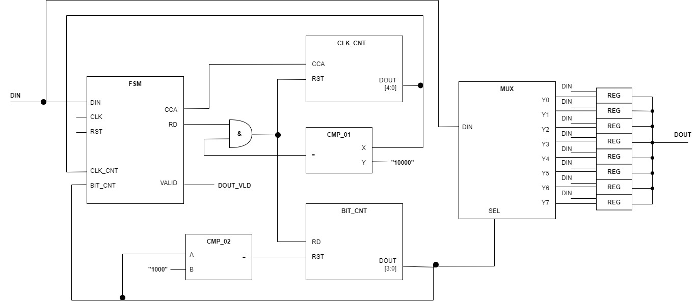
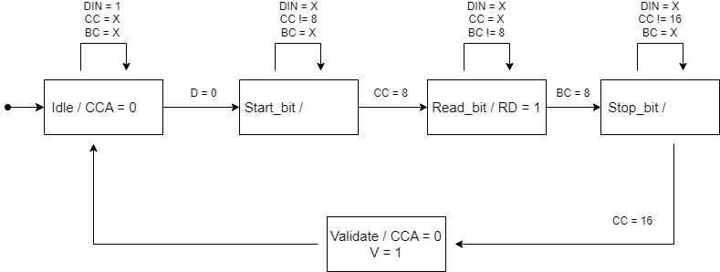

# INC - Project

### Author Information
**Name:** Michal Repčík  
**Login:** xrepcim00  
**Date:** _22.4.2024_

## Table of Contents

1. [Circuit Architecture (at RTL level)](#circuit-architecture-at-rtl-level)
    - [Circuit Diagram](#circuit-diagram)
    - [Function Description](#function-description)
2. [Finite State Machine Design](#finite-state-machine-design)
    - [FSM Diagram](#fsm-diagram)
        - [Legend](#legend)
        - [Notes](#notes)
    - [Function Description](#fsm-function-description)

## Circuit Architecture (at RTL level)

### Circuit Diagram

### Function Description

The FSM is a state machine used to control the individual components of the circuit. It has three outputs: CCA (CLOCK_CYCLE_ACTIVE), RD (READING_DATA), and VALID.

- **CLK_CNT** and **BIT_CNT** are counters that count clock cycles and processed bits, respectively. When CLK_CNT reaches the value of 16 during data reading, BIT_CNT is incremented, and CLK_CNT is reset.
- If BIT_CNT reaches the value of 8, it is reset.
- **CMP_01** and **CMP_02** compare the counter outputs with given values and reset/increment the counters accordingly.
- **MUX** is a multiplexer that receives data from DIN and uses SEL to distribute the data to designated outputs, which then place the data into registers.

## Finite State Machine Design

### FSM Diagram

#### Legend
- **States:** Idle, Start_bit, Read_bit, Stop_bit, Valid
- **Input Signals:** D (DIN), CC (CLK_CNT), BC (BIT_CNT)
- **Moore Outputs:**
  - CCA (CLK_CNT_ACTIVE) = 1
  - RD (READING_DATA) = 0
  - VALID = 0

#### Notes
Undefined Moore outputs in the diagram are identical to the outputs listed in the legend.

### FSM Function Description

- **Idle State:** The FSM waits for DIN = 0, indicating a Start bit.
- **Start_bit State:** Waits for 8 clock cycles (middle of the bit) and then transitions to the Read_bit state.
- **Read_bit State:** The FSM waits until BIT_CNT reaches the value of 8, then transitions to the Stop_bit state.
- **Stop_bit State:** The FSM waits for 16 clock cycles and then transitions to the Validate state.
- **Validate State:** This state is used to transition back to the Idle state and validate the processed data.
